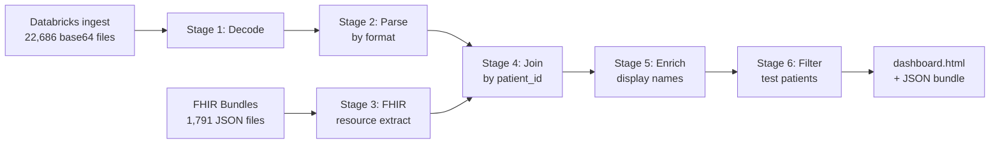

# About the Pipeline

A short, well-instrumented Python pipeline that turns a heterogeneous patient-directed SMART on FHIR data dump into a researcher-usable browser, with no server infrastructure.

## The problem

When a patient authorizes a registry through SMART on FHIR with OAuth 2.0, what comes back is **not** a clean stream of structured data. Most major US EHRs return DocumentReference resources whose Binary content is a mixture of:

- True C-CDA XML documents
- HTML fragments (clinical notes encoded inline)
- RTF documents (Epic-format clinic notes)
- PDF reports (imaging, pathology, etc.)
- Plus parallel FHIR Bundles for discrete resources (Conditions, Observations, Medications, etc.)

A registry that wants to use this data has to decode all of it, parse it correctly per format, link every record to a canonical patient identifier, and surface it in something a clinician can read. **That last mile is where most patient registries get stuck.**

## The pipeline (six stages)

| Stage | Script | Purpose |
|---|---|---|
| 1 | `ccda_decoder_final.py` | Double-base64 decode |
| 2 | `ccda_parser_v4.py` | Magic-byte format detection (XML / HTML / RTF / PDF), then per-format extraction |
| 3 | `fhir_parser.py` | Walks FHIR Bundles across 13 resource types; resolves subject references |
| 4 | `final_joiner_v3.py` | Joins all sources by canonical `patient_id`; tags every row with `source: ccda` or `source: fhir` |
| 5 | `enrich_display_names.py` | Backfills missing LOINC/SNOMED display names from a built-in lookup |
| 6 | `filter_test_patients.py` | Removes test or non-clinical patient records via a configuration-driven exclusion file |

Total: approximately 2,000 lines of Python. Runtime: approximately 13 minutes on a commodity workstation for the full ARC dataset.

## Architecture decisions worth highlighting

### Local-first

The dashboard is a single static HTML file. The data is a single JSON file. Both run entirely client-side, in the analyst's browser, with no server, no authentication layer, and no telemetry. For team sharing, the entire artifact is uploaded to organizational Box with named-user permissions. This pattern inherits an existing Business Associate Agreement and audit logging without requiring custom infrastructure.

### Format detection by magic bytes, not filename

When a FHIR DocumentReference returns Binary content, the file extension says nothing about the actual format. The pipeline detects format by inspecting the first few bytes of each file (`%PDF-`, `{\rtf1`, `<?xml`, `
`, etc.) and routes to the appropriate parser. This is a 50-line addition to the pipeline that prevents a substantial fraction of silent data loss.

### Source-provenance preservation

Every row in the dashboard carries a `source` column (`ccda` or `fhir`) and a `file` column with the original source filename. When a clinical fact appears in both a C-CDA Problem List and a FHIR Condition resource, the dashboard preserves both rows so reviewers can audit each independently.

### Test patients filtered via a config file

Test or training records that originated upstream are not removed by hand-curating final outputs. They are listed in a plain-text exclusion file (`test_patients.txt`) and filtered by a dedicated pipeline stage. The filter supports patient_id, exact name, name substring, and MRN substring matching.

### CSV export from every tab

Each tab has an Export CSV button that downloads only the displayed records as RFC 4180-conformant CSV with UTF-8 byte-order mark. There is also a per-patient full-record export and a cohort patient-list export. These exports preserve the source provenance tags so downstream analytic workflows (including OMOP CDM ingestion) can re-create the same dedupe and weighting logic the dashboard applies.

## What it produces

- A multi-sheet Excel workbook with all extracted clinical data, suitable for downstream NLP / analysis
- Per-resource CSV files
- A unified JSON bundle (~210 MB for our cohort) consumed by the static HTML dashboard
- Per-tab and per-patient CSV exports on demand from the dashboard

## What it does not do (yet)

- It does not perform deduplication where C-CDA and FHIR sources report the same clinical fact. Each instance is presented separately with its source tag; downstream consumers handle dedup as appropriate.
- It does not include a built-in OMOP CDM ETL. The CSV exports preserve all source codes and timestamps needed for OMOP conversion via OHDSI's Usagi or a similar tool, but we leave the actual ETL to the consuming registry.
- It does not implement probabilistic record linkage to study identifiers. We elected to omit unreliable name-based matches rather than display them.

## Read more

The methods are described in detail in a forthcoming JAMIA Brief Communication. See [For Other Registries](adopt.md) for the adaptation guide, or jump straight to the [Live Demo](demo.md).
